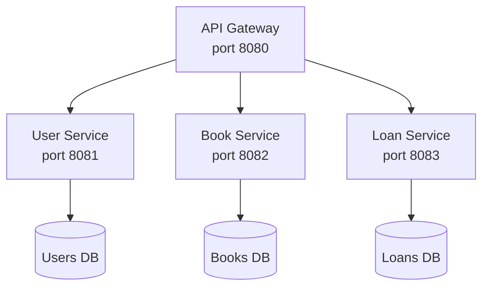
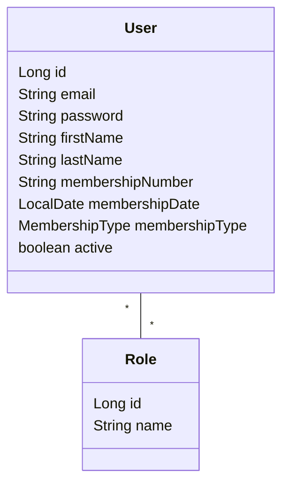
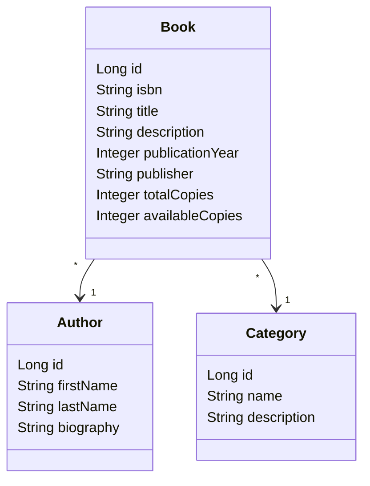
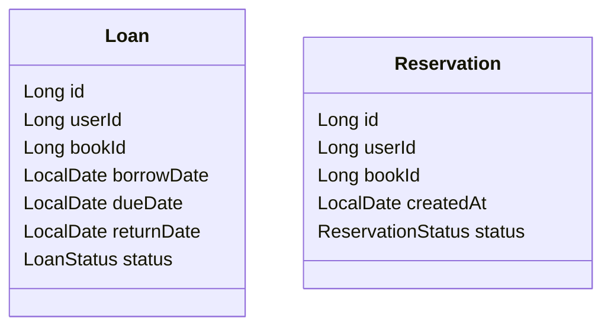

# TP Complet : Système de Gestion de Bibliothèque

## Vue d'ensemble

Ce TP fil rouge couvre tous les modules de la formation. Vous allez construire un système de gestion de bibliothèque composé de plusieurs microservices.

## Architecture cible

```text
                    ┌─────────────────┐
                    │   API Gateway   │
                    │   (port 8080)   │
                    └────────┬────────┘
                             │
       ┌─────────────────────┼─────────────────────┐
       │                     │                     │
       ▼                     ▼                     ▼
┌─────────────┐      ┌─────────────┐      ┌─────────────┐
│ User Service│      │ Book Service│      │ Loan Service│
│ (port 8081) │      │ (port 8082) │      │ (port 8083) │
└──────┬──────┘      └──────┬──────┘      └──────┬──────┘
       │                    │                    │
       ▼                    ▼                    ▼
   ┌───────┐            ┌───────┐            ┌───────┐
   │Users  │            │Books  │            │Loans  │
   │  DB   │            │  DB   │            │  DB   │
   └───────┘            └───────┘            └───────┘
```



---

## Module 1 : Analyse et conception

### Objectif
Concevoir l'architecture du système.

### Bounded Contexts identifiés

| Context | Responsabilité | Entités |
|---------|---------------|---------|
| **Users** | Gestion des membres et employés | User, Role |
| **Catalog** | Gestion du catalogue de livres | Book, Author, Category |
| **Loans** | Gestion des emprunts | Loan, Reservation |

### Livrables
- [ ] Schéma d'architecture
- [ ] Diagramme des entités par service
- [ ] Liste des APIs (endpoints)

### Diagrammes des entités (Mermaid)







---

## Module 2 : User Service

### Objectif
Créer le microservice de gestion des utilisateurs.

### Entités

```java
@Entity
public class User {
    private Long id;
    private String email;
    private String password;
    private String firstName;
    private String lastName;
    private String membershipNumber;
    private LocalDate membershipDate;
    private MembershipType membershipType; // STANDARD, PREMIUM
    private boolean active;
    private Set<Role> roles;
}
```

### Endpoints

| Méthode | URL | Description |
|---------|-----|-------------|
| GET | /api/users | Liste des utilisateurs |
| GET | /api/users/{id} | Détail d'un utilisateur |
| POST | /api/users | Créer un utilisateur |
| PUT | /api/users/{id} | Modifier un utilisateur |
| DELETE | /api/users/{id} | Supprimer un utilisateur |
| GET | /api/users/{id}/loans | Emprunts d'un utilisateur |

### Tâches
- [ ] Créer le projet Spring Boot
- [ ] Implémenter l'entité User
- [ ] Créer les DTOs et le Mapper
- [ ] Implémenter le Repository
- [ ] Implémenter le Service
- [ ] Créer le Controller REST
- [ ] Écrire les tests
- [ ] Configurer application.yml

---

## Module 3 : Book Service

### Objectif
Créer le microservice de gestion du catalogue.

### Entités

```java
@Entity
public class Book {
    private Long id;
    private String isbn;
    private String title;
    private String description;
    private Integer publicationYear;
    private String publisher;
    private Integer totalCopies;
    private Integer availableCopies;

    @ManyToOne
    private Author author;

    @ManyToOne
    private Category category;
}

@Entity
public class Author {
    private Long id;
    private String firstName;
    private String lastName;
    private String biography;
}

@Entity
public class Category {
    private Long id;
    private String name;
    private String description;
}
```

### Endpoints

| Méthode | URL | Description |
|---------|-----|-------------|
| GET | /api/books | Liste des livres |
| GET | /api/books/{id} | Détail d'un livre |
| GET | /api/books/isbn/{isbn} | Recherche par ISBN |
| GET | /api/books/search?q= | Recherche full-text |
| POST | /api/books | Ajouter un livre |
| PUT | /api/books/{id} | Modifier un livre |
| DELETE | /api/books/{id} | Supprimer un livre |
| PATCH | /api/books/{id}/copies | Modifier le nombre de copies |

### Communication avec User Service

Le Book Service appelle le User Service pour vérifier les emprunts.

```java
@FeignClient(name = "user-service")
public interface UserClient {
    @GetMapping("/api/users/{id}")
    UserDto findById(@PathVariable Long id);
}
```

### Tâches
- [ ] Créer le projet Spring Boot
- [ ] Implémenter les entités
- [ ] Configurer OpenFeign
- [ ] Implémenter le Repository avec recherche
- [ ] Implémenter le Service
- [ ] Créer le Controller REST
- [ ] Écrire les tests

---

## Module 4 : Dockerisation

### Objectif
Conteneuriser les services.

### Dockerfile (User Service)

```dockerfile
FROM eclipse-temurin:21-jre-alpine
WORKDIR /app
COPY target/*.jar app.jar
EXPOSE 8081
ENTRYPOINT ["java", "-jar", "app.jar"]
```

### docker-compose.yml

```yaml
version: '3.8'
services:
  postgres:
    image: postgres:16-alpine
    environment:
      POSTGRES_USER: library
      POSTGRES_PASSWORD: library
    volumes:
      - postgres_data:/var/lib/postgresql/data
    ports:
      - "5432:5432"

  user-service:
    build: ./user-service
    ports:
      - "8081:8080"
    environment:
      - SPRING_PROFILES_ACTIVE=docker
      - DB_HOST=postgres
    depends_on:
      - postgres

  book-service:
    build: ./book-service
    ports:
      - "8082:8080"
    environment:
      - SPRING_PROFILES_ACTIVE=docker
      - USER_SERVICE_URL=http://user-service:8080
    depends_on:
      - postgres
      - user-service

volumes:
  postgres_data:
```

### Tâches
- [ ] Créer les Dockerfile pour chaque service
- [ ] Configurer docker-compose.yml
- [ ] Créer les profils Spring `docker`
- [ ] Tester le déploiement local

---

## Module 5 : Sécurité

### Objectif
Sécuriser l'API avec JWT.

### Configuration

```yaml
jwt:
  secret: ${JWT_SECRET}
  expiration: 3600000
```

### Endpoints d'authentification

| Méthode | URL | Description |
|---------|-----|-------------|
| POST | /api/auth/register | Inscription |
| POST | /api/auth/login | Connexion |
| POST | /api/auth/refresh | Rafraîchir le token |

### Règles de sécurité

| Endpoint | Accès |
|----------|-------|
| /api/auth/** | Public |
| /api/books (GET) | Authentifié |
| /api/books (POST/PUT/DELETE) | ADMIN ou LIBRARIAN |
| /api/users (GET) | ADMIN ou soi-même |
| /api/users (POST/DELETE) | ADMIN |
| /api/loans/** | Authentifié |

### Tâches
- [ ] Ajouter Spring Security
- [ ] Implémenter JwtService
- [ ] Créer le filtre JWT
- [ ] Configurer SecurityConfig
- [ ] Créer AuthController
- [ ] Propager le token entre services
- [ ] Tester les accès

---

## Module 6 : Résilience

### Objectif
Ajouter la résilience et automatiser le déploiement.

### Loan Service avec Resilience4j

```java
@Service
public class LoanService {

    @CircuitBreaker(name = "bookService", fallbackMethod = "borrowFallback")
    @Retry(name = "bookService")
    public LoanDto borrow(Long userId, Long bookId) {
        // Vérifier le livre (appel Book Service)
        BookDto book = bookClient.findById(bookId);

        if (book.getAvailableCopies() < 1) {
            throw new BookNotAvailableException(bookId);
        }

        // Créer l'emprunt
        Loan loan = new Loan();
        loan.setUserId(userId);
        loan.setBookId(bookId);
        loan.setBorrowDate(LocalDate.now());
        loan.setDueDate(LocalDate.now().plusWeeks(3));
        loan.setStatus(LoanStatus.ACTIVE);

        // Décrémenter les copies
        bookClient.decrementCopies(bookId);

        return loanMapper.toDto(loanRepository.save(loan));
    }

    public LoanDto borrowFallback(Long userId, Long bookId, Exception ex) {
        // Enregistrer la demande pour traitement ultérieur
        return new LoanDto(null, userId, bookId, null, null,
                          LoanStatus.PENDING, "Service temporairement indisponible");
    }
}
```

### Tâches
- [ ] Ajouter Resilience4j au Loan Service
- [ ] Configurer les circuit breakers

---

## Structure des dossiers

```
library-microservices/
├── discovery-server/
│   ├── src/
│   ├── Dockerfile
│   └── pom.xml
├── library-frontend/
│   ├── src/
│   └── package.json
├── api-gateway/
│   ├── src/
│   ├── Dockerfile
│   └── pom.xml
├── user-service/
│   ├── src/
│   ├── Dockerfile
│   └── pom.xml
├── book-service/
│   ├── src/
│   ├── Dockerfile
│   └── pom.xml
├── loan-service/
│   ├── src/
│   ├── Dockerfile
│   └── pom.xml
├── docker-compose.yml
└── README.md
```
